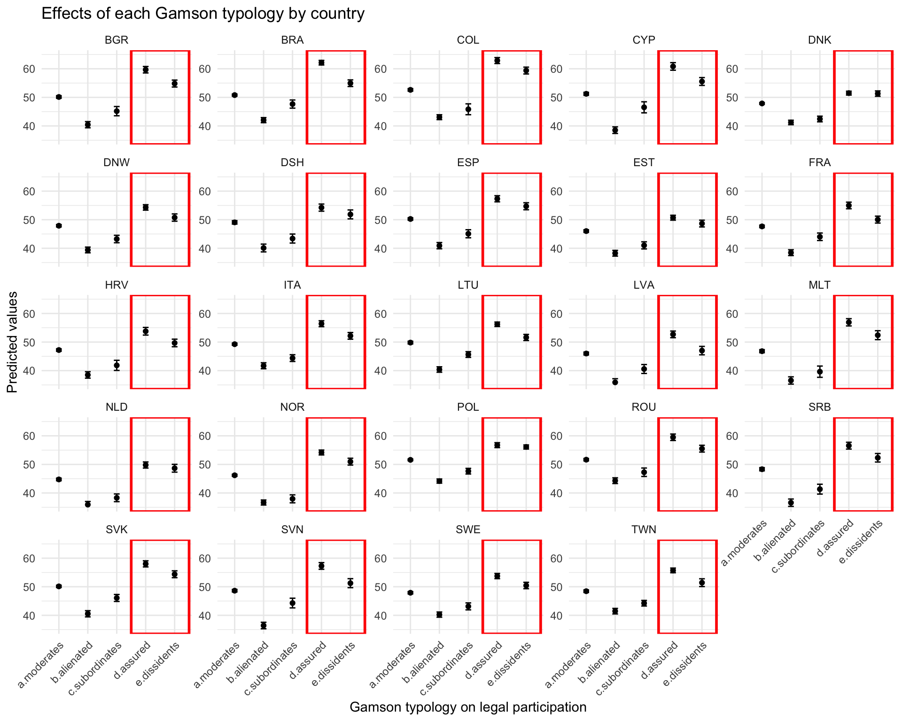
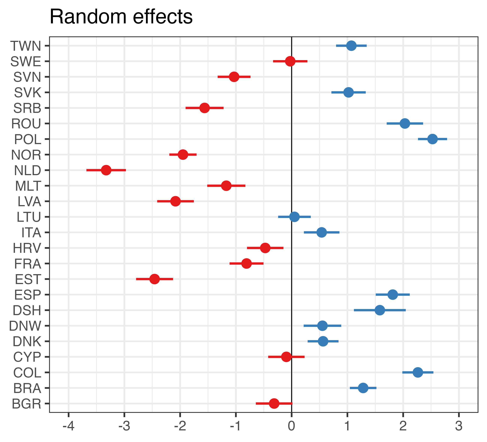
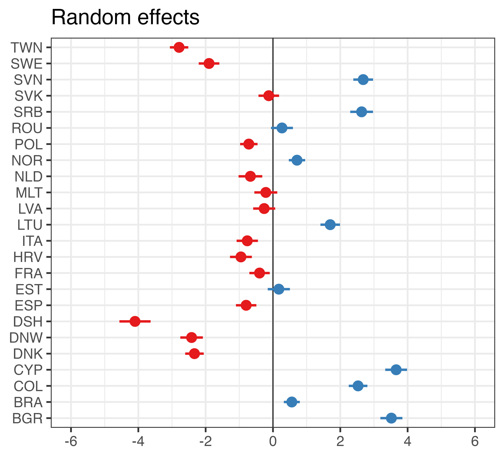

# Introduction.

- Young people have played a prominent role in the global trend towards protest participation to the detriment of more traditional forms of political involvement. 

- In recent years younger generations have not only been the drivers and protagonists of the protest but often exceeded their more peaceful and “normalized” forms to make their demands heard.

```{r echo=FALSE, out.width = '100%'}
knitr::include_graphics("torniquetes.jpg")
```

# Research question(s)

-   What drives some young people to adopt radical forms of protest, while others stick to conventional participation—or choose not to get involved at all? 

- What factors are associated with the expected participation among a population still undergoing political socialization?

- Studies on the individual determinants of political participation typically focus on the resource model, political opportunities, or biographical availability.

- However, the variables used in these models help predict participation but are less useful to distinguish between forms of participation.

# "Estallido Social" in Chile in 2019.


# "Gamson’s Hypothesis" or the Mistrustful-Efficacious Hypothesis

- In 1968, concerned by the growing social mobilization and the decline of trust in institutions among young people in the United States, sociologist William Gamson proposed the following hypothesis regarding participation in protests:

"\textbf{An optimal condition of political mobilization was a combination of low political trust and high internal political efficacy. This can “stoke the fires” of political activism, including protesting, joining rallies, and participating in demonstrations}" (Gamson 1968, 48.)

- In this vein, Norris (1999) calls "critical citizens" and Dalton (2004) "dissatisfied democrats" those who show low trust toward institutions and the established political system but at the same time trust that individual and collective action can bring about change. 

# Our (in progress) work.

- Gamson's hypothesis has been tested mostly in adult populations and in case studies with ambiguous results.

- Using the combination of institutional trust and political self-efficacy to generate typologies of “expected political participants”, we test this  hypothesis, in an adolescent sample across 24 countries.

# Data and Measurements

-  We employ the International Civic and Citizenship Education Study 2022 - ICCS, around 80000 students in 8th grade (ages 14-15) from 24 countries participated .

- We developed the "Gamson typology," which classifies students into four groups based on their levels of self-efficacy and political trust. To define these levels, we used the 25th and 75th percentiles as cutoff points, categorizing students as having either low or high self-efficacy and political trust accordingly. 

# Self-Efficacy and Institutional Trust

- Scale Students' citizenship self-efficacy (S_ CITEFF) is an IRT WLE scores with mean of 50 and standard deviation of 10 across equally weighted participating countries that met sample participation requirements, based on seven items regarding the degree of agreement with the following statements: IS4G29A: Argue your point of view about a controversial political or social issue, IS4G29B: Stand as a candidate in a [school election], IS4G29C: Organise a group of students in order to achieve changes at school, IS4G29D: Follow a debate about a controversial issue, IS4G29E: Write a letter or email to a newspaper giving your view on a current issue, IS4G29F: Speak in front of your class about a social or political issue, IS4G29G: Assess the credibility of information about political or social issues. 

- Students' trust in civic institutions (S_INTRUST) is an IRT WLE scores with mean of 50 and standard deviation of 10 across equally weighted participating countries that met sample participation requirements, based on six items assessing the degree of trust that students have in the following institutions: IS4G27A: The [national government] of [country of test], IS4G27B:The [local government] of your town or city, IS4G27C: Courts of justice, IS4G27D: The police, IS4G27E:Political parties, and IS4G27F: [Parliament/congress].  

# Gamson typology

The "Gamson groups" are as follows: 

- \textbf{“Dissidents.”} (or "Critical Citizens"): youth who scored above the 75th percentile (high) in internal efficacy but below the 25th percentile (low) in political trust
- \textbf{Assureds} (or Loyals): High internal efficacy and high political trust.
- \textbf{Alienated}: Low internal efficacy and low political trust.
- \textbf{Subordinates}: Low internal efficacy and low political trust.
- \textbf{Moderates} Those youth who reported intermediate levels of self-efficacy and institutional trust 

# Gamson typologies and hypothesis on expected political participation.

- \textbf{“Dissidents.”} (or "Critical Citizens"): greater expectation of "illegal" or disruptive participation, compared to other groups.
- \textbf{Assureds} (or Loyals): greater expectation of "legal" or conventional participation, compared to other groups.
\linebreak
- \textbf{Alienated}: Lower expectation of any kind of participation, compared to other groups.
- \textbf{Subordinates}: Lower expectation of any kind of participation, compared to other groups.
\linebreak
- \textbf{Moderates}: The reference category. Any significant difference observed in each category within the "Gamson typology" thus should be interpreted as a difference concerning the more typical group.

# Types of Participation

We use two dependent variables that measure the intention to engage in different forms of participation:

- \textbf{Expected participation in legal activities} (S_LEGACT): composed of various items that ask whether the students has the intention to participate in different actions: IS4G31A: Talk to others about your views on political or social issues, IS4G31B: Contact an [elected representative], IS4G31C: Take part in a peaceful march or rally, IS4G31D: Collect signatures for a petition, IS4G31E: Contribute to an online discussion about social or political issues and IS4G31F: Organise an online campaign 

- \textbf{Expected participation in illegal protest activities} (S_ILLACT), composed of various items that ask whether the students has the intention to participate in different actions: IS4G31K Spray-paint protest slogans on walls, IS4G31L: Stage a protest by blocking traffic, and IS4G31M: Occupy public buildings as a sign of protest. 


# Predicted values for Legal Participation

```{r echo=FALSE, out.width = '100%'}

```

# Predicted values for Illegal Participation

```{r echo=FALSE, out.width = '100%', out.height='97%'}
knitr::include_graphics("illegal.png")
```


# Discussion

- Our results indicate significant variation in expectations of legal and illegal participation across countries, suggesting the existence of contextual factors associated with the formation of participation expectations.

- The Distrustful-Effective Hypothesis is partially fulfilled. The most effective groups (Assured and Dissidents) do indeed show higher expectations of participation. However, there is no clear preference for one form of participation or another according to the participant categories.

- The "Assured" (high political trust and high self-efficacy) are the group with the highest expectations of participation, both legal and illegal, in the different countries studied.

# Discussion 

- We conducted a similar analysis using a Chilean sample, and those results aligned more closely with Gamson’s hypothesis. 

- One possible explanation is that in the Chilean study we examined actual participation, whereas the ICCS data capture expectations.

- Youth with high self-efficacy—regardless of their institutional trust—may view multiple forms of engagement as normatively acceptable and even necessary. 

# Discussion

- This aligns with other studies in adult populations that have found a growing positive correlation between protest participation and electoral participation.

- Notably, Chile stands out as an exception. It is one of the few—if not the only—countries where the gap between electoral participation and protest participation has widened.

- This leads us to consider the need to explore contextual and institutional explanations to better understand how political participation expectations are formed among populations undergoing political socialization.

# Random Effects for Legal Participation by country

```{r echo=FALSE,out.width = '80%', out.height='80%'}

```

# Random Effects for Ilegal Participation by country

```{r echo=FALSE,out.width = '80%', out.height='80%'}

```


# Conclusion

- Understanding the determinants behind political participation expectations among young people is essential for grasping the future of democratic engagement.

- Adolescents are not merely passive recipients of political messages—they are actively constructing their political identities and frameworks for action.

- By examining how self-efficacy and institutional trust interact to shape these expectations, we gain critical insight into the early stages of political socialization. 

- Ultimately, we believe that keep working on this research will help us to understand the roots of democratic participation and equips us to better support inclusive, responsive, and engaged civic cultures in the years to come.

# Thank you!


- Felipe Sánchez-Barría (fasanchez@uc.cl)


- Daniel Miranda (danmiranda@uchile.cl)

